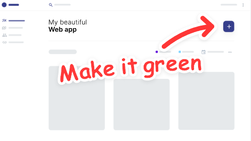
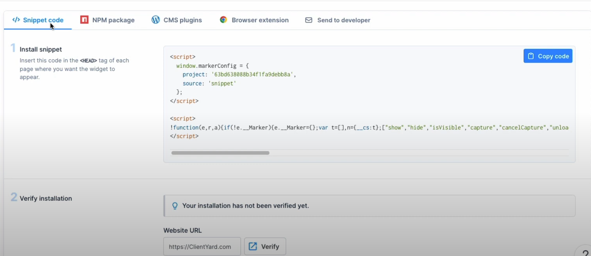
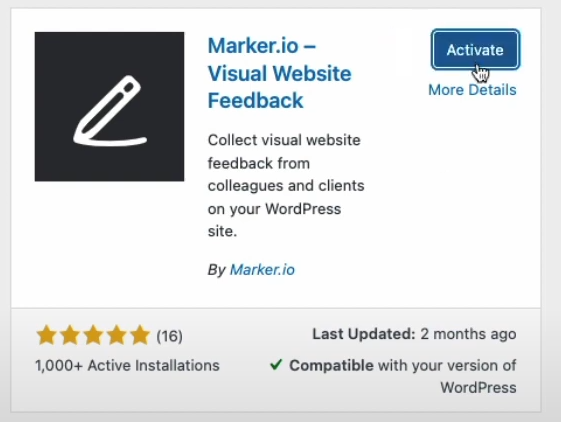
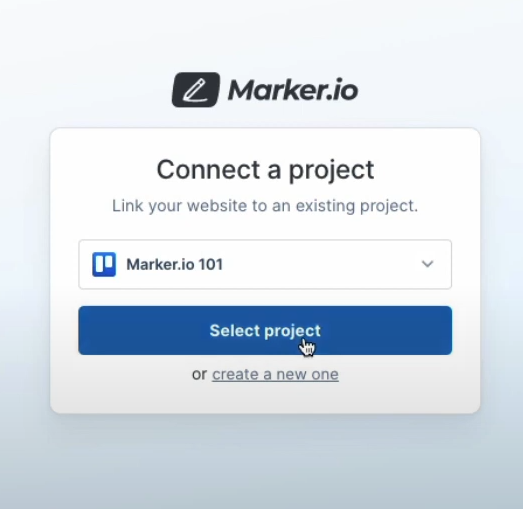

## Introduction

Marker.io is a visual feedback and bug reporting tool primarily used by web development and design teams. It allows users to capture screenshots, annotate them with comments and drawings, and then send them directly to project management or issue tracking tools like Jira, Trello, GitHub, or Asana.

The tool simplifies the process of reporting bugs or providing feedback on websites or web applications by streamlining communication between developers, designers, and stakeholders. Instead of relying on written descriptions of issues, users can visually pinpoint problems or suggest changes, making it easier for teams to understand and address them efficiently.

The story began with 3 friends and a passion for the web.
After building hundreds of websites for all types of clients, we had the idea for Marker.io: a simple way to report bugs on live websites, and collect client feedback along the way.
Fast-forward to today, Marker.io has evolved into a feedback solution for enterprise-scaled organizations.

## Brief History

2015: Company Founded, co-founders Gary Gaspar, Olivier Kaisin, and Emile-Victor Portenart were running a web design agency, when they realized just how laborious and inefficient quality assurance (QA) testing was. Enter Marker.io, an intuitive, visual tool for reporting bugs and providing feedback on websites and web applications.

2020: Marker.io launch, Since launching their tool in 2020, Marker.io has grown rapidly. “We've got 5,000 customers who have reported more than 3 million issues using their tool.”

## Features

**Integration** Can integrate to collect feedback with GitHub, GitLab, Trello, Jira and many more.

**Widget Overview** takes screenshot that the user can annontate, edit and contains the feedback form.

**Installation Methods** can be done with a snippet code directly to the code if you have access, CMS plugin (for Wordpress, Squarespace, Drupal and more), Browser extention or NPM package.

**Session replay** offers a contextual understanding of the users report, leading uip to their feedback submition. You can watch the last 30 seconds (or more) before the reporter submitted their feedback.

**Metadata** displays the feedback users technical data such as OS, Browser type, Resolution, Viewport, Pixel Ratio and Zoom.

**Communication** is saved in the feedback page and the integrated platform if there is any.

**Status Sync** closing issues in tool will automatically resolve and notify the feedback reporter and the integrated platform. ( can be disabled per project basis )

**Team Collaboration** Enable team members to comment and collaborate directly within the context of the feedback or bug report.

**Guest Reporting** Allows non-team members to submit feedback without needing an account, ideal for client or user testing phases.

**Template Customization** Customize templates for bug report forms or feedback to include relevant fields, making the reporting process standardized and efficient.

## Pros

- Collects all feedback in one place in the same format. 

- Limit feedback to only your internal team.

- Easily choose who can see the widget and report feedback and set up different forms for QA and customers.

- Easy to install and distribute to testers.

- Can integrate with many popular platforms.

- The feedback can be as simple or as detailed as the users want.

- Managing Members and Guest users is simple and intuative.

- Clarify customer issues, in context. Communicate with your customers directly inside marker.io without giving them access to your platform.

- Notifys customers when issues have been resolved.

- Unlimited guest users and projects.

- Free trial

## Cons

- The Cost. Marker.io may have pricing plans that might not be suitable for smaller teams or budgets, especially if they require advanced features or a large number of users.

- Limited access. Limitations for members/developers to view feedback unless require additional payment to subscription, limiting members to teams of 3 or 15 depending on subscription plan.

- Learning Curve. While Marker.io aims to be user-friendly, there may still be a learning curve for new users, especially those who are not familiar with similar tools or digital workflows.

- Dependency on Integrations. Marker.io heavily relies on integrations with project management and issue tracking tools. If there are issues or limitations with these integrations, it could affect the overall functionality and usability of Marker.io.

## Market Comparison

### BugHerd

Both BugHerd and Marker.io serve similar purposes, but they have slightly different approaches to collecting and managing feedback on websites. BugHerd focuses on direct feedback by clicking on elements, while Marker.io emphasizes screenshot capture and annotation. The choice between them often depends on the specific needs and preferences of the users and their teams.

## Installation

To install copy the snippet code generated by the site and paste it inside the `<HEAD>` tag of each page where you want the widget to appear.

Alternatively, for WordPress sites, you can simply install the Marker.io Plugin and log in to Marker.io to select your project.

## Conclutions

Marker.io has established itself as an effective feedback tool, particularly well-suited for smaller teams of three people or fewer. Its niche specialization in the market for visual feedback and bug reporting tools allows it to stand out, not only due to limited competition but also through its distinctive features that aims to help compact teams.
Despite its strengths, potential users should consider the scale of their projects. For larger teams or projects requiring more robust collaboration features and deeper integrative capacities, exploring additional or complementary tools might be necessary to fully address their needs.

## References

- [Marker.io](https://marker.io/features)
- [Linkedin Markerio](https://be.linkedin.com/company/markerio)
- [Marker-io YouTube](https://www.youtube.com/@markerio)